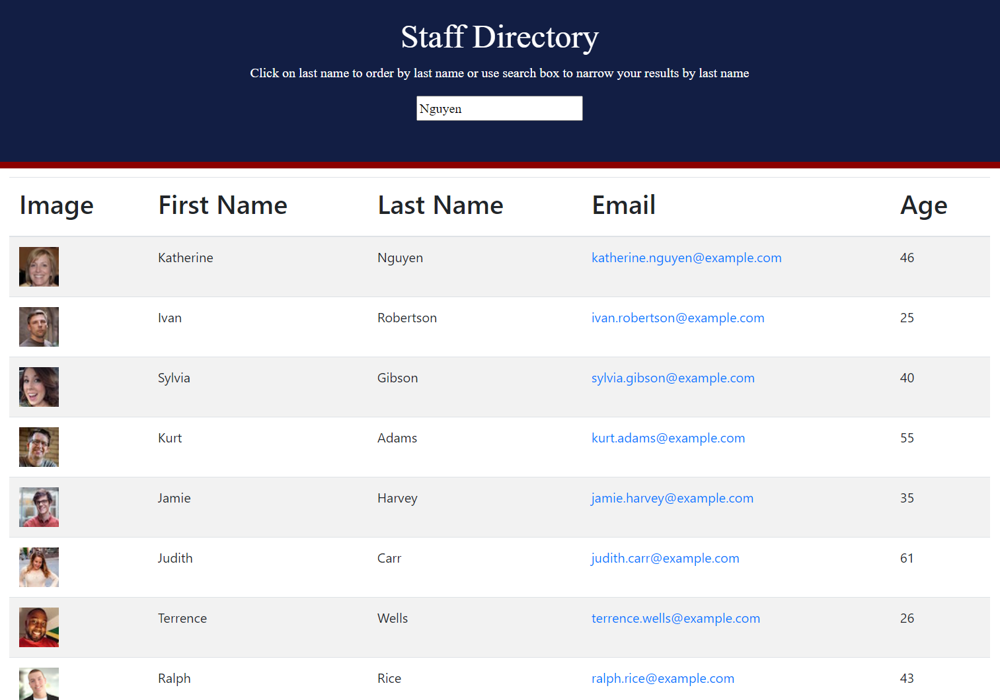

## Title

React Staff Directory

## Description

This project is a staff directory with names pulled in from a random user API.

## Table of Contents :

[Title](#Title),
[Description](#Description),
[Link](#Link),
[Screenshot](#Screenshot),
[Usage](#Usage),
[License](#License),
[Contributors](#Contributors),
[Questions](#Questions)

## Link:

https://lnoeltner1.github.io/staff_directory/

## Screenshot

## Usage

My project can be used for educational or personal use only.

## License

This project is licensed under the MIT license.

## Contributors

Lauren Noeltner

## Questions

You can ask questions at: github.com/LNoeltner1
